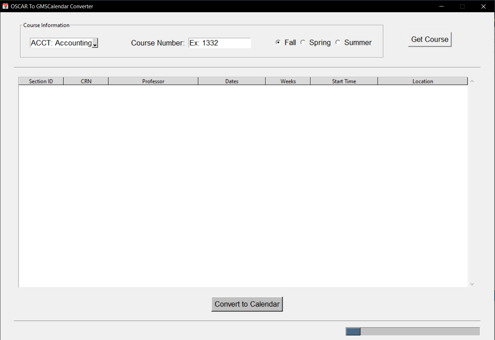

# OSCAR to Google and MSCalendar Converter

This is a software that is designed to fetch a specific course's information from Georgia Tech's OSCAR website and convert it into an event in Google or Microsoft Calendar.

## Download
This software can not downloaded at my github [repository](https://github.com/Timiport/OSCAR-to-Google-and-MSCalendar)

## Get Started
1. Launch the program by clicking `Calendar-Converter.exe`

2. Click one of the options in the login window to login to either Google or Microsoft calendar.
Then you will be greeted by this screen

3. Select course subject, fill in course number, and choose semester and click `Get Course`

4. From the list of courses in the table, select the course you registered, and click `Convert to Calendar`

5. And that's all.

## Privacy Disclosure
### User Data
To improve efficiency, this software will generate `token.json` if user login with Google Calendar or `o365_token.txt` if user login with Microsoft calendar. 

With this temporary token, user does not need to login the next time when launching this software.

Note: this token is only temporary and will expire after a period of time.

### Privacy policy
The tokens generated above is only stored **locally**.

This software will **NOT** upload or share this token or any user's data with any party.
For more information, please view this software's privacy policy
* [https://timiport.github.io/OSGMSCalendar-Privacy-Policy/](https://timiport.github.io/OSGMSCalendar-Privacy-Policy/)
